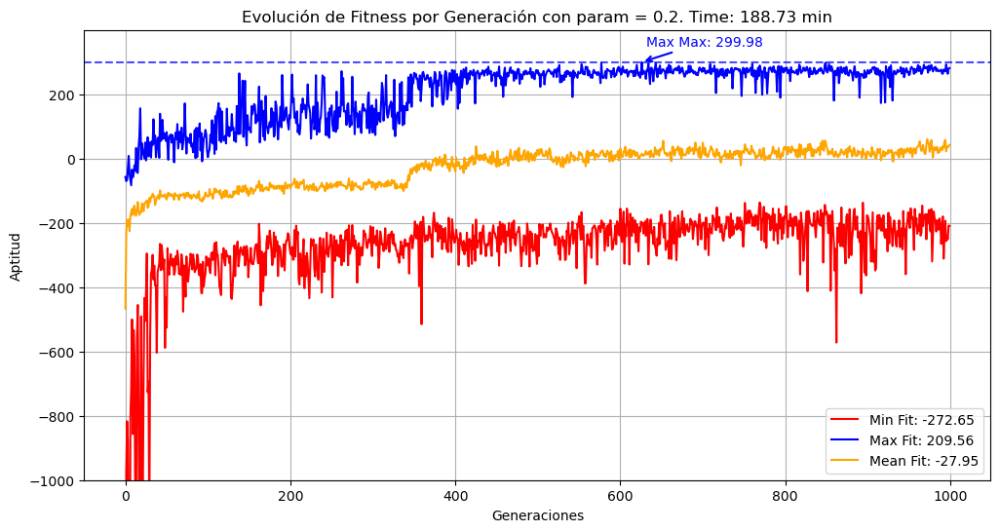
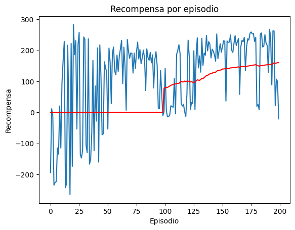
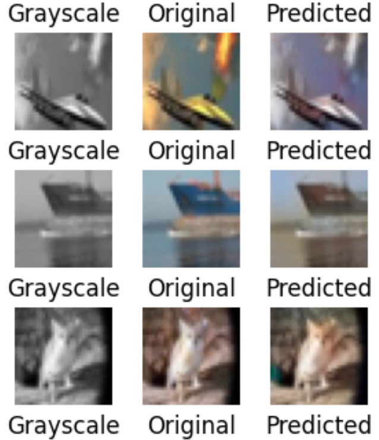

# Reinforcement Learning and Generative Models Project

## 🚀 Overview

This project explores reinforcement learning (RL) and generative models through multiple implementations and experiments. The main components include:

- **LunarLander Environment**: Implementing a genetic evolutionary algorithm based on rewards.
- **Deep Q-Network (DQN)**: Applying a DQN agent to improve performance in the LunarLander environment.
- **Generative Adversarial Network (GAN)**: Implementing a U-Net architecture for image colorization.

## 📌 Features

### 🧠 Reinforcement Learning

- **Genetic Evolutionary Algorithm**: The LunarLander agent is trained using an evolutionary approach where individuals are evaluated by a reward-based fitness function.
- **Deep Q-Network (DQN)**: A DQN model is trained to optimize the agent’s actions, maximizing the cumulative reward.

### 🎨 Generative Models

- **GAN with U-Net**: A Generative Adversarial Network incorporating a U-Net architecture is used to colorize grayscale images.

## 📊 Results
- **LunarLander with Genetic Algorithm**: The agent evolves over generations, showing improvements in landing stability.

  

- **DQN Agent**: The agent learns an optimal landing policy, surpassing the genetic algorithm in efficiency.

  

- **GAN U-Net Colorizer**: The model successfully learns to colorize grayscale images with realistic outputs.

 

